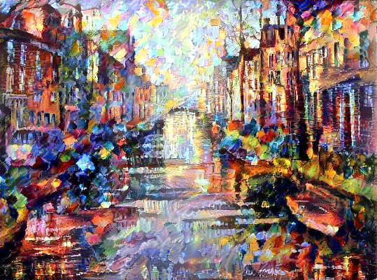
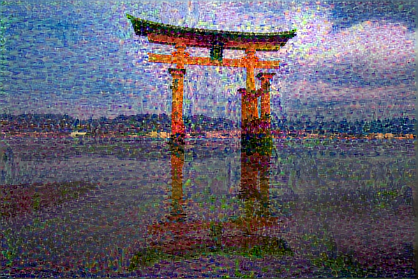
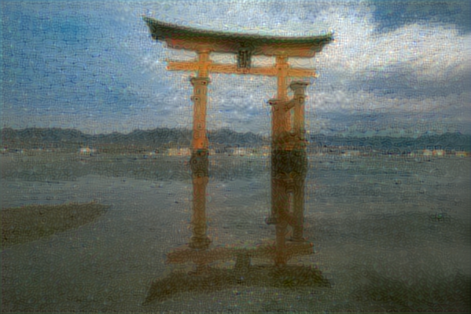
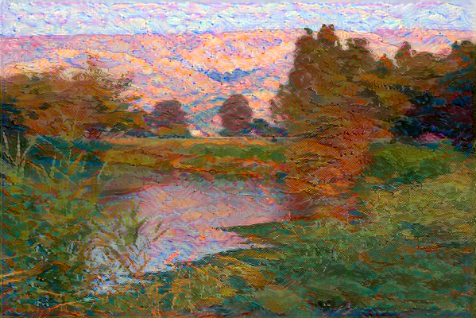
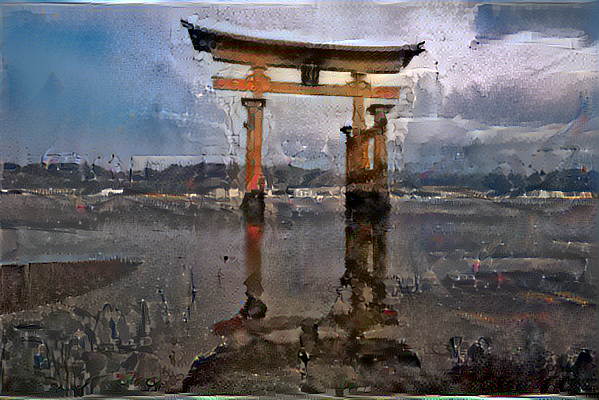
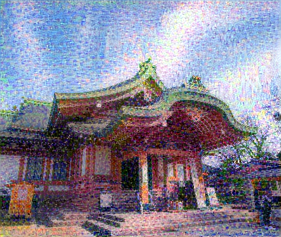

# neural-style-transfer
Creating artistic images via neural style transfer.

This is a work in progress.

This project is based on the idea presented by Gatys et al. in the paper "A Neural Algorithm of Artistic Style". https://arxiv.org/abs/1508.06576

The code is based on the neural style transfer example given in the Keras documentation.

Below are some examples of images created using this code.

